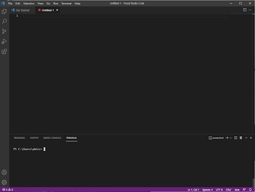
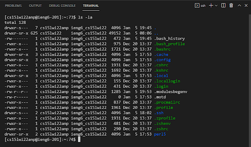
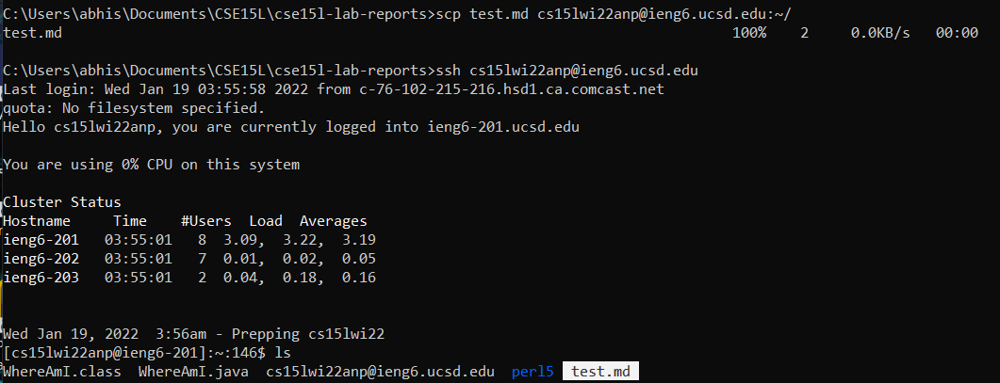
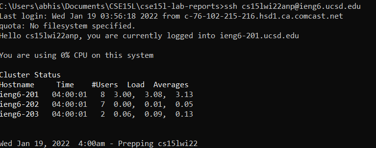

# Lab Report Week 2

*Abhishek Govindarasu*


## How to Login to ieng6 Servers
> 1. Install VSCode
>> Download VSCode [here](https://code.visualstudio.com/download)
>> 
> 2. Login via SSH
>> ```bash
>> ssh cs15lwi22zzz@ieng6.ucsd.edu
>> ```
> 3. Use Unix Commands on ieng6 Server
>> Type ```help``` for system unix commands
>> 
> 4. Using scp to transfer files
>> 
>> ```bash
>> scp file cs15lwi22zzz@ieng6.ucsd.edu:~/
>> ```
> 5. SSH Keys
>> ```bash
>> ssh-keygen
>> ```
>> Now login without password
>>  
> 6. Optimization
>> ```bash
>> scp file.java cs15lwi22zzz@ieng6.ucsd.edu:~/; ssh cs15lwi22zzz@ieng6.ucsd.edu "javac file.java; java file"
>> ```


