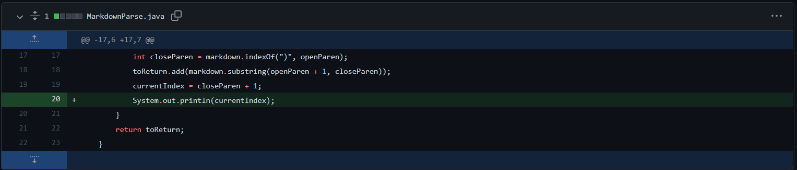
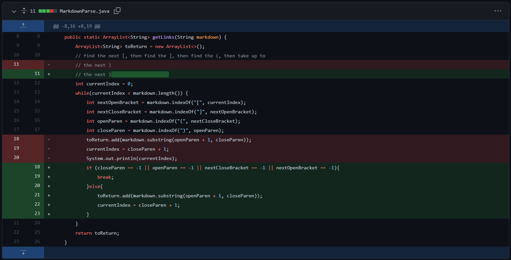

# Lab Report Week 4

*Abhishek Govindarasu*

## Code Changes in Markdown Parse

1. Debug for error checking

[file_0](markdown_test/markdown5.md)
Adds println to show the value of the current
index for debug purposes. This is to fix runtime 
errors that occur when non-matching parenthesis
or no links are found in the file.

2. Fix for non-matching brackets/paranthesis 

[file_1](markdown_test/markdown3.md)

The previous code will find the indices of opening
and closing parenthesis using java's indexOf, however
does not error handle when no character exists, 
causing a RuntimeError in String.substring. This fix
ensures all indices are valid before parsing a url.

3. Fix for parsing images vs. links

[file_2](markdown_test/markdown4.md)

The previous code will parse image source the same
way as the href of links. This fix ensures images
are skipped in the parsing of links.
 