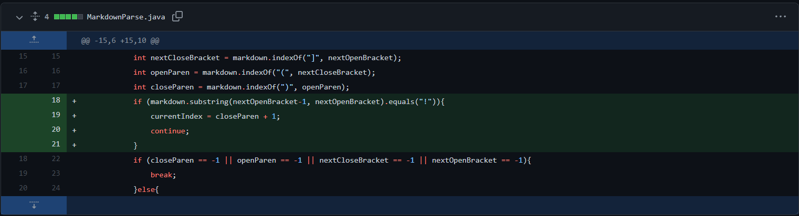

# Lab Report Week 4

*Abhishek Govindarasu*

# Code Changes in Markdown Parse

## 1. Debug for error checking
Originally: 
`java MarkdownParse markdown5.md` would runtime error 
due -1 value of indexOf.

[file_0](markdown_test/markdown5.md)

Adds println to show the value of the current
index for debug purposes. This is to fix runtime 
errors that occur when non-matching parenthesis
or no links are found in the file.

While this is not directly a bug, being able to see 
the index allows help for debug. Even though this could
be done through debuggers, and error logs, for a small
piece of code like this without too complicated and deep
function calls, println is efficient.

## 2. Fix for non-matching brackets/paranthesis 
Originally:
`java MarkdownParse markdown3.md` would runtime error due
to -1 return from indexOf.

[file_1](markdown_test/markdown3.md)

The previous code will find the indices of opening
and closing parenthesis using java's indexOf, however
does not error handle when no character exists, 
causing a RuntimeError in String.substring. This fix
ensures all indices are valid before parsing a url.

The bug is that the calls for next closing parenthesis,
next closing bracket, etc. are being called using the 
return value of the previous call. However its not
guarenteed that the previous value is not a index,
so substring fails.

## 3. Fix for parsing images vs. links
Originally:
`java MarkdownParse markdown.md` would include images when 
capturing links.

[file_2](markdown_test/markdown4.md)

The previous code will parse image source the same
way as the href of links. This fix ensures images
are skipped in the parsing of links.

The bug is that the way the parser parses also captures 
images, which has a similar format. The fix is ensuring the
format does not clash with that format of the images, by
ensuring the previous character is not `!`
 