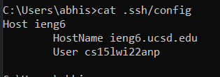
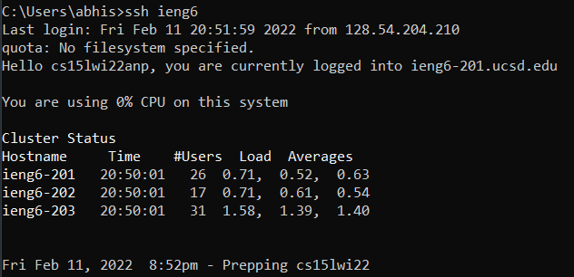
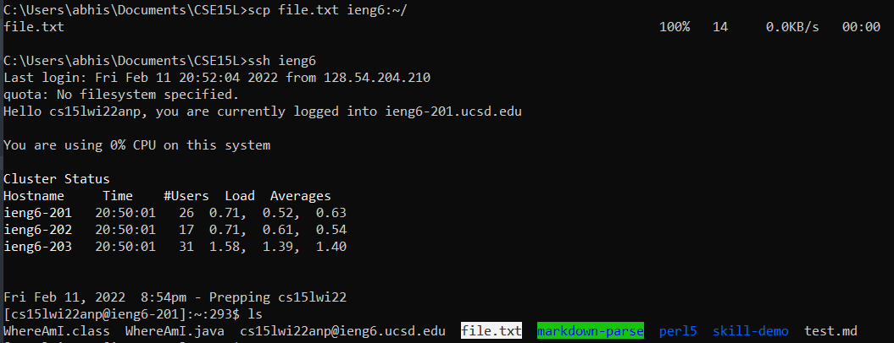

# Lab Report Week 6

*Abhishek Govindarasu*


## Streamlining SSH Configuration

# 1. Edit ssh config file


```bash
cd .ssh
nano config
```

Change into the ssh directory. Using any editor, in this case
nano, create/edit the config file. Add:
```
Host ieng6
        HostName ieng6.ucsd.edu
        User cs15lwi22qqq
```
replacing qqq with the user account letters.

# 2. SSH with host alias


```bash
ssh ieng6
```

Will directly login you into your user account
on ieng6.ucsd.edu. 

# 3. SCP with host alias


```bash
scp file.txt ieng6:~/
```

Will directly copy a file to the ieng6 server on the
provided user account.

As seen in the image, the file is now in the server.
