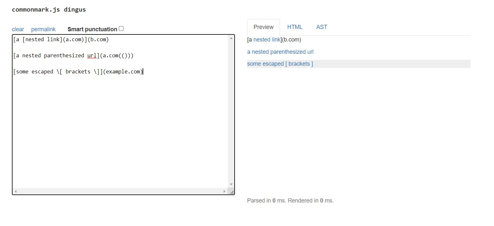

# Lab Report Week 8

*Abhishek Govindarasu*

# Markdown Parse Code | Snippit Review

## 1. Snippit 1
```
`[a link`](url.com)

[another link](`google.com)`

[`cod[e`](google.com)

[`code]`](ucsd.edu)
```


My Code  


## 2. Snippit 2
```
[a [nested link](a.com)](b.com)

[a nested parenthesized url](a.com(()))

[some escaped \[ brackets \]](example.com)
```





My Code  


## 3. Snippit 3
```
[this title text is really long and takes up more than 
one line

and has some line breaks](
    https://www.twitter.com
)

[this title text is really long and takes up more than 
one line](
    https://ucsd-cse15l-w22.github.io/
)


[this link doesn't have a closing parenthesis](github.com

And there's still some more text after that.

[this link doesn't have a closing parenthesis for a while](https://cse.ucsd.edu/


)

And then there's more text
```


My Code  


# Changes
## 1. Changes for snippit 1
Yes, changing the regex from `(?<![!\\])\[.+\]\((.*)\)` to `(?<![!\\])\[[a-zA-Z0-9_ ]+\]\((.*)\)` will exclude all special characters including those code blocks from being present in the link
text.


## 2. Changes for snippit 2
Yes, this solution is scuffed as heck but you can `.+` and then for loop in the capture group to ensure all special characters are escaped. There might be an exclusivey regex solution using lookback but regex is dumb.

Edit this took me way too long to figure out holy.
```/(?<![!\\])\[(?:[a-zA-Z_ ]+(?:\\[\[\]\(\)\!`]+)*)+[a-zA-Z]*\]\((.*|\n.+|.+\n|\n.+\n)\)```


## 3. Changes for snippit 3
Yes, markdown convention is to treat 2 new lines as a force line break.
For the url itself new lines are not allowed inside the link itself, only around the brackets. Allowing newlines involves changing (including edits from 1) `(?<![!\\])\[[a-zA-Z0-9_ ]+\]\((.*)\)` to `(?<![!\\])\[[a-zA-Z0-9_ ]+\]\((.*|\n.+|.+\n|\n.+\n)\)`
For the links itself however, new lines are allowed only if consecutive new lines aren't present.
